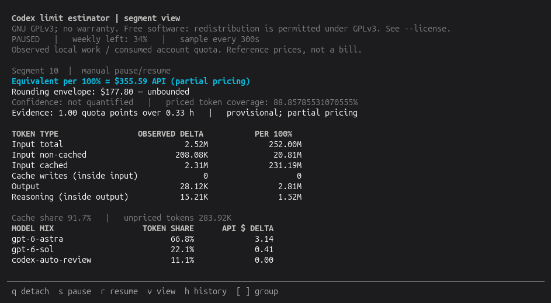
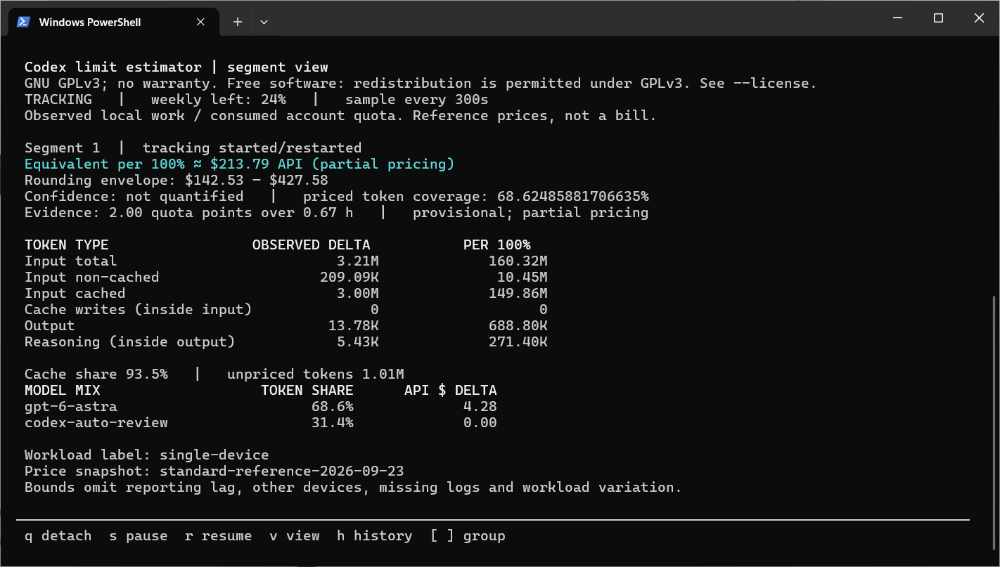

# Usage Tools for Codex

Terminal tools for monitoring local Codex token usage and account quota, with a
live dashboard, saved history, and CSV/JSON exports. The estimator compares usage
with quota consumption to estimate the token volume and API-equivalent cost per
100% of weekly quota.

**In development. Linux and Windows are currently supported platforms.**

An independent community project, not affiliated with or endorsed by OpenAI.





## Installation

### Linux/macOS

Requires **Python 3.10+** (including SQLite and curses), **Bash**, and an installed,
authenticated **Codex CLI** on your `PATH`. No additional Python packages or API
key are needed.

On Linux, you can optionally run `bash doctor.sh` from the repository root to
check dependencies before installing.

Clone or download this repository, then run from its root directory:

```bash
bash install.sh
```

Commands are installed in `~/.local/bin`; make sure it is on your `PATH`.
Check local usage and account quota:

```bash
codex-usage
codex-quota
```

The first usage scan may take a while if you have a large session history.

### Windows

Requires **Python 3.10+** and an installed, authenticated **Codex desktop app or
CLI**. From PowerShell:

```powershell
git clone https://github.com/modeismodei/usage-tools-for-codex.git
cd usage-tools-for-codex
powershell.exe -NoProfile -ExecutionPolicy RemoteSigned -File .\configure.ps1
powershell.exe -NoProfile -ExecutionPolicy RemoteSigned -File .\doctor-windows.ps1
powershell.exe -NoProfile -ExecutionPolicy RemoteSigned -File .\install.ps1
```

See the [installation guide](docs/INSTALL.md) for details and troubleshooting.

## Usage

Start tracking and open the terminal interface:

```bash
# Linux/macOS
codex-limit-estimator start tracking
```

```powershell
# Windows
codex-limit-estimator.cmd start tracking
```

On Windows, append `.cmd` to the command names in the examples below; the same
applies to `codex-usage` and `codex-quota`.

The tracker runs in the background and samples every five minutes by default.
Estimates become available after new usage and quota consumption are observed.
Press `q` to close the interface **without stopping tracking**, `s` to pause, or
`r` to resume. Press `v` to switch between segment, run, and daily views.

```bash
codex-limit-estimator           # Reopen the interface
codex-limit-estimator status    # Check tracker status
codex-limit-estimator shutdown  # Stop the background process
```

History is kept locally. To restart tracking after a shutdown or reboot, use
`codex-limit-estimator resume`. No automatic startup service is installed.

## Updating

These steps use default paths. For custom paths or multiple trackers, follow
the [upgrade guide](docs/UPGRADING.md).

Stop the collector before updating:

```bash
codex-limit-estimator shutdown
codex-limit-estimator status
```

Wait until status shows `Daemon: offline`. Update your checkout or download a
fresh source archive, then run from its root directory. On Linux/macOS:

```bash
bash install.sh --upgrade
```

On Windows, rerun the PowerShell installer and accept the upgrade prompt:

```powershell
powershell.exe -NoProfile -ExecutionPolicy RemoteSigned -File .\install.ps1
```

Open a new terminal, then migrate and inspect your saved history:

```bash
codex-limit-estimator migrate
codex-limit-estimator runs
codex-limit-estimator report
```

After checking the history, restart tracking with `codex-limit-estimator resume`.
The upgrade guide also covers backups and rollback.

## Understanding the estimates

Results compare **local usage and account quota consumed over the same period**.
They are estimates, not an API bill or an official subscription allowance.
Small samples, rounded quota readings, missing prices, and activity on other
devices can affect the result. Keep prices and workloads comparable when
comparing runs.

The tools read local session logs and query quota through Codex; they do not
submit prompts or run model workloads. See the [user guide](docs/USAGE.md) for
pricing, data storage, and interpretation.

## Documentation

- [Installation guide](docs/INSTALL.md): setup, updates, and troubleshooting.
- [User guide](docs/USAGE.md): running the tools on Windows and Linux/UNIX-like systems.
- [Command reference](docs/COMMANDS.md): controls, history, analysis, and exports.
- [Analysis and exports](docs/ANALYSIS.md): calculations, selection rules, and data formats.
- [Data and side effects](docs/SIDE-EFFECTS.md): files, processes, network access, and privacy.

## License

[GNU GPL v3.0 only](LICENSE) (`GPL-3.0-only`). Free software, provided without
warranty. See [NOTICE](NOTICE), or run any command with `--license` for the full
terms.
